# TikZ Diagrams Agent Skill

An agent skill for turning written prompts, screenshots, paper figures, and rough sketches into compiled, visually checked TikZ/PGF diagrams and `animate.sty` animations.

The installable skill is the folder:

```text
skills/tikz-diagrams/
```

Install the whole folder, not only `SKILL.md`. The folder contains the scripts, references, fixtures, and reusable templates that make the workflow reliable.

## Quickstart: Install And Use

Repository URL:

```text
https://github.com/Patrick-Healy/tikz-diagrams-skill
```

### Easiest Install: Ask Your Agent

You can copy-paste this into Codex, Claude Code, Cursor, Gemini CLI, Copilot Chat, or another coding agent and ask it to install the skill for you:

```text
Install this TikZ diagrams skill from GitHub:
https://github.com/Patrick-Healy/tikz-diagrams-skill

Install only the skill folder at:
skills/tikz-diagrams/

Put it in the correct global or project skill location for this agent. After installing, confirm that SKILL.md, scripts/, references/, templates/, and tests/ are present. Do not install missing TeX, Python, Poppler, ffmpeg, or ImageMagick dependencies without asking me first and explaining what each dependency is needed for.
```

This is usually the best route if you are not sure where your agent stores skills. The agent should clone the repository, copy the whole `skills/tikz-diagrams/` folder, and then tell you whether rendering dependencies are already available.

After installation, restart or reload the agent session so it discovers the new skill.

### Codex

```text
$skill-installer install https://github.com/Patrick-Healy/tikz-diagrams-skill/tree/main/skills/tikz-diagrams
```

Manual install:

```bash
mkdir -p ~/.codex/skills
git clone https://github.com/Patrick-Healy/tikz-diagrams-skill.git /tmp/tikz-diagrams-skill
rsync -a /tmp/tikz-diagrams-skill/skills/tikz-diagrams/ ~/.codex/skills/tikz-diagrams/
```

### Claude Code

```bash
mkdir -p ~/.claude/skills
git clone https://github.com/Patrick-Healy/tikz-diagrams-skill.git /tmp/tikz-diagrams-skill
rsync -a /tmp/tikz-diagrams-skill/skills/tikz-diagrams/ ~/.claude/skills/tikz-diagrams/
```

For rendering workflows, make sure TeX, Poppler, Python packages, `ffmpeg`, and ImageMagick are installed; see [Dependencies](#dependencies). If they are missing, ask your agent to explain the install source and package list before it downloads anything.

### First Prompt To Try

After installing, start a new agent session and ask it to use the skill:

```text
Use the tikz-diagrams skill to create a standalone teaching-mode TikZ diagram of parallel trends in difference-in-differences. Compile it, render it, run visual Quality Assurance (QA), and include a QA note.
```

### Local Smoke Test

After cloning the repo:

```bash
export SKILL_DIR="$PWD/skills/tikz-diagrams"
python3 "$SKILL_DIR/scripts/check_tikz_safety.py" "$SKILL_DIR/templates/standalone.tex"
```

## Prompt Menu

Use these short forms once the skill is installed. Full copy-paste prompts are in [Prompt Cookbook](#prompt-cookbook).

- **Teaching slide**: `Use the tikz-diagrams skill to create a standalone teaching-mode TikZ diagram for [TOPIC]. Compile, render, run visual QA, and include a QA note.`
- **Research figure**: `Use the tikz-diagrams skill to create a standalone research-mode TikZ figure for [TOPIC]. Use direct labels, run visual QA, and run the math/diagram logic gate if geometry or estimates matter.`
- **Animation**: `Use the tikz-diagrams skill to create an animate.sty animation for [MECHANISM]. Decide motion form and pacing before rendering; produce a GIF preview and contact sheet.`
- **Screenshot or paper figure**: `Use the tikz-diagrams skill to recreate and improve this source figure: [PATH OR URL]. Preserve the substantive meaning and document source context.`
- **Hand-drawn style**: `Use the tikz-diagrams skill to turn this hand-drawn sketch into a readable hand-drawn-style TikZ figure or animation: [IMAGE PATH].`
- **Precise iteration**: `Use the tikz-diagrams skill to revise [FIGURE.tex]. Patch only [EXACT CHANGES], save as v02, rerun checks, and update the QA note.`

## What This Skill Does

This skill helps an AI agent behave less like a one-off TikZ snippet writer and more like a careful figure assistant.

- It creates standalone TikZ diagrams for teaching, research, and compact layouts.
- It compiles LaTeX to PDF and renders PNG previews.
- It runs static TikZ safety checks before compilation.
- It runs rendered visual QA for title-band collisions, text overlap, clipped labels, and crowding.
- It builds contact sheets for batches, variants, and critique rounds.
- It creates inspectable frame decks, GIF previews, and contact sheets for `animate.sty` animations.
- It records design, math, and animation decisions in QA notes so readers can understand what was checked.

## How To Read The Examples

Each example below shows the same workflow pattern:

1. **Input context**: a written prompt, screenshot, paper figure, or rough drawing.
2. **Skill decision**: the agent chooses a figure family and presentation mode.
3. **Rendered output**: static PNG, animated GIF preview, or contact sheet.
4. **QA interpretation**: checks that explain why the figure is usable.

The point is not that every figure should look like these. The point is that the agent should expose what it is doing: selecting a diagram grammar, preserving source context, running render checks, and distinguishing schematic visual communication from exact mathematical geometry.

## Showcase

### 1. Written Prompt To Static Teaching Diagram

Use this path when there is no visual input. The prompt itself is the input artifact.

| Input | Output |
|---|---|
| `Use the tikz-diagrams skill to create a standalone teaching-mode TikZ diagram of parallel trends in difference-in-differences. Compile it, render it, run visual QA, and include a QA note.` | 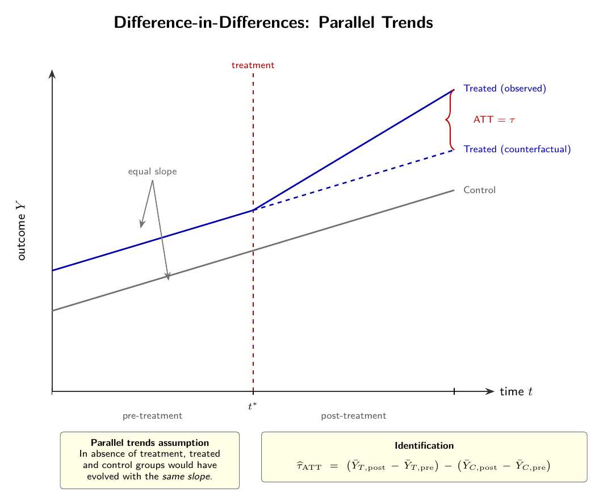 |

**What to notice:** the output focuses on the untreated counterfactual trend and post-treatment comparison, rather than crowding the slide with caption prose.

Skill decision: `teaching` mode | family: `axis/curve` | math review: `schematic` | outputs: PDF, PNG, visual QA JSON, QA note.

Checks to expect: `teaching` mode, standalone `.tex`, compiled PDF, rendered PNG, visual QA, QA note.

### 2. Static Game Tree To Paced Animated Build

Use this path when a static game tree is dense. The animation should reveal the reading order instead of adding more labels.

| Input context | Output |
|---|---|
| 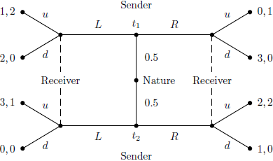 | 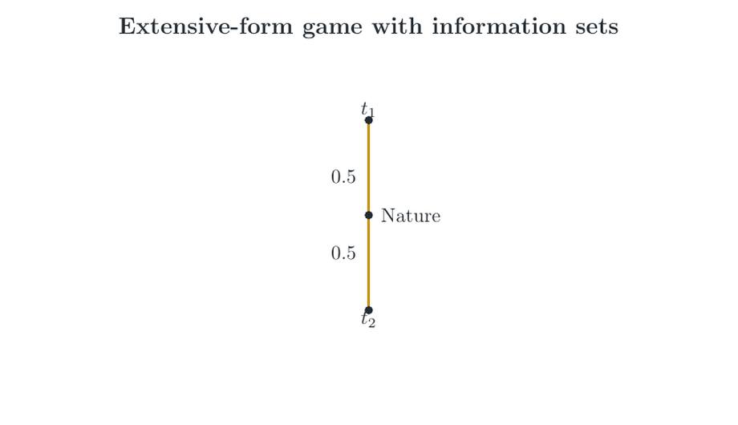 |

Source input: [`gjoncas/Econ-Diagrams`, `pics/signaling.png`](https://github.com/gjoncas/Econ-Diagrams/blob/master/pics/signaling.png).

**What to notice:** the animation builds Nature, Sender choices, Receiver information sets, Receiver actions, and terminal payoffs in sequence. Dense states need pacing; a viewer needs time to read payoffs and information sets.

Skill decision: `teaching` animation | family: `tree/branch` | logic review: payoff and information-set check | outputs: GIF preview and contact sheet.

Checks to expect: tree grammar, chance probabilities, information sets, payoff labels, frame sequence, pacing gate, GIF preview.

The workflow is: source or static tree context, then paced animation. The source screenshot comes from the public Econ-Diagrams repository.

### 3. Paper Figure To Animated Research Figure

Use this path when a paper figure is the source of truth and the agent must preserve the model context while animating the mechanism.

| Input paper figure | Animated output and contact sheet |
|---|---|
| 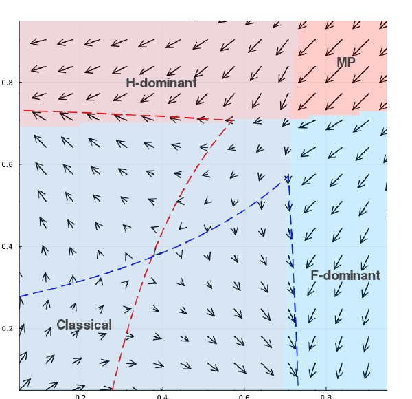 | 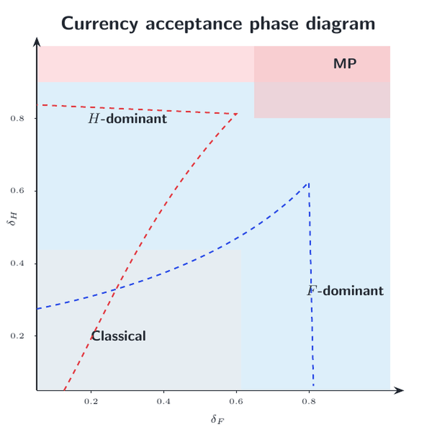<br><br>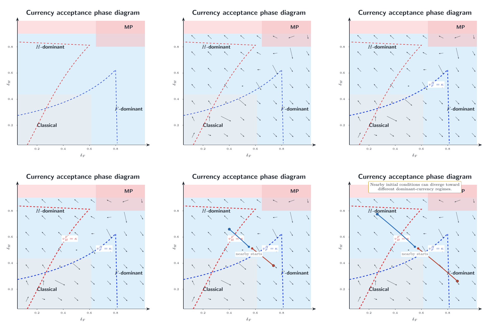 |

Source context: NBER Working Paper 34817, Figure 3, "International Currency Dominance." The figure is a phase diagram for strategic complementarities in accepting foreign currency: arrows show net incentives, dashed loci show cost thresholds, and colored regions mark monetary regimes.

**What to notice:** the output includes both a GIF preview and a contact sheet. For animations, playback and the frame sequence are part of the figure and must be inspected.

Skill decision: `research` animation | family: `threshold/phase transition` | source context: paper figure | outputs: GIF preview and animation contact sheet.

Checks to expect: source context in QA note, figure family chosen, animation frames inspected, rendered visual QA reviewed.

### 4. Paper Screenshot To Animated Corridor Figure

Use this path when a source paper already has the right geometry and the animation should reveal the logic frame by frame.

| Input paper figure | Output |
|---|---|
| 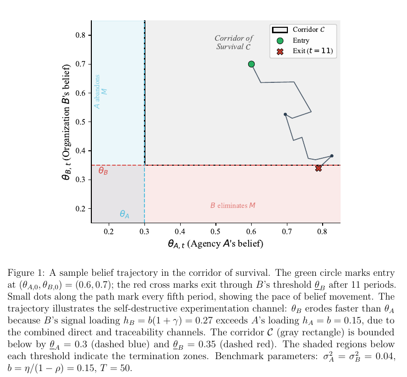 | 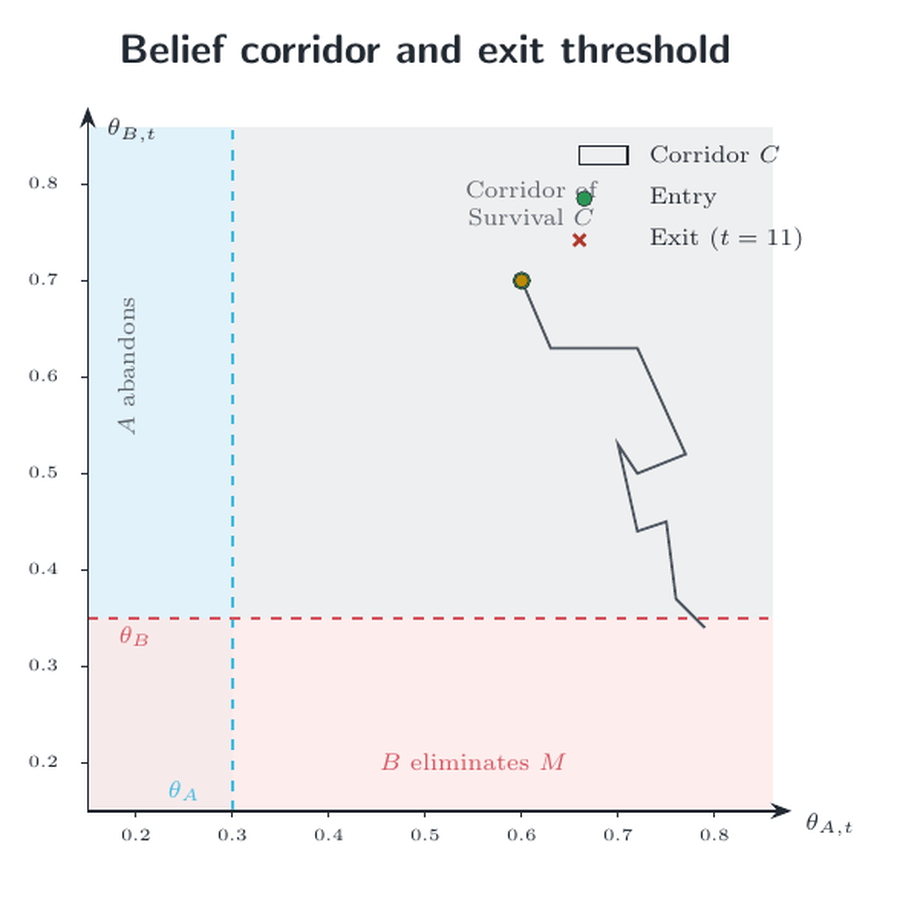 |

Source context: NBER Working Paper 35085, "Le Bureau des Legendes: A Dynamic Theory of Double Agents." Figure 1 shows a belief trajectory inside a corridor of survival, with entry, exit, fixed thresholds, and termination regions.

**What to notice:** the corridor and thresholds stay fixed, the path is revealed smoothly, and the exit marker appears only after the crossing condition is true.

Skill decision: `research` animation | family: `threshold/corridor trajectory` | math review: threshold logic | outputs: GIF preview.

Checks to expect: threshold logic, region inequalities, fixed axes, frame truth, exit marker timing.

### 5. Rough Sketch To J-Curve Animation

Use this path when a rough drawing encodes timing. The useful animation is the delayed response, not extra explanation inside the image.

| Input sketch | Output |
|---|---|
| 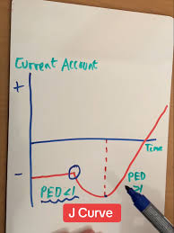 | 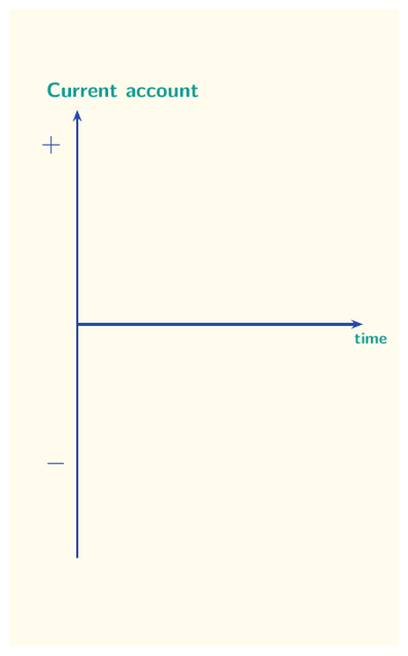 |

Input context: a TikTok-style current-account J-curve sketch. After a devaluation or policy event, the current account initially deteriorates below baseline before recovering and improving over time.

**What to notice:** the animation reveals the event marker, trough, recovery, and final improvement. Longer interpretation belongs in surrounding text or a QA note.

Skill decision: `teaching` animation | family: `delayed-adjustment path / J-curve` | math review: `schematic` | outputs: hand-drawn-style GIF preview.

Checks to expect: delayed-adjustment path, event timing, baseline, trough, recovery, externalized caption.

Prompt pattern:

```text
Use the tikz-diagrams skill to turn this hand-drawn J-curve sketch into a hand-drawn-style animated TikZ figure. Preserve the rough classroom-board feel, but make the axes, event marker, trough, recovery path, and final improvement readable. Render a GIF preview and include a QA note.
```

### 6. Rough Sketch To Exact AD-AS Animation

Use this path when the input is rough but the output should obey explicit curve logic.

| Input sketch | Output |
|---|---|
| 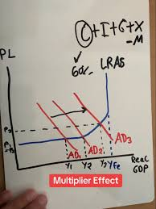 | 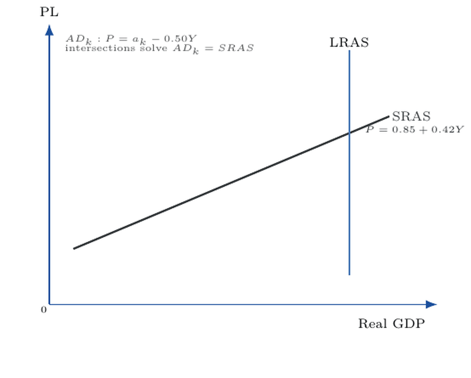 |

Input context: an AD-AS multiplier-effect sketch with PL and real GDP axes, SRAS/LRAS, three AD curves, dashed equilibrium guides, and a multiplier label.

**What to notice:** this output uses the math-logic gate. SRAS and AD schedules are declared as equations, intersections are computed, and the output-change bracket attaches to calculated equilibrium output levels.

Skill decision: `teaching` animation | family: `axis/curve` | math review: `exact` | outputs: GIF preview and QA note.

Checks to expect: `math_logic_review: exact`, declared equations, computed intersections, static safety, PDF compile, GIF preview.

Prompt pattern:

```text
Use the tikz-diagrams skill to animate this hand-drawn-style AD-AS multiplier sketch. Keep the classroom-sketch look if useful, but run the math/diagram logic gate: either mark the result schematic or compute the AD/SRAS intersections from declared equations.
```

### 7. TeXample Animation Patterns Adapted By Department

Use this path when an agent needs to adapt a known animation idea to a new teaching domain.

| Pattern family | Summary output |
|---|---|
| 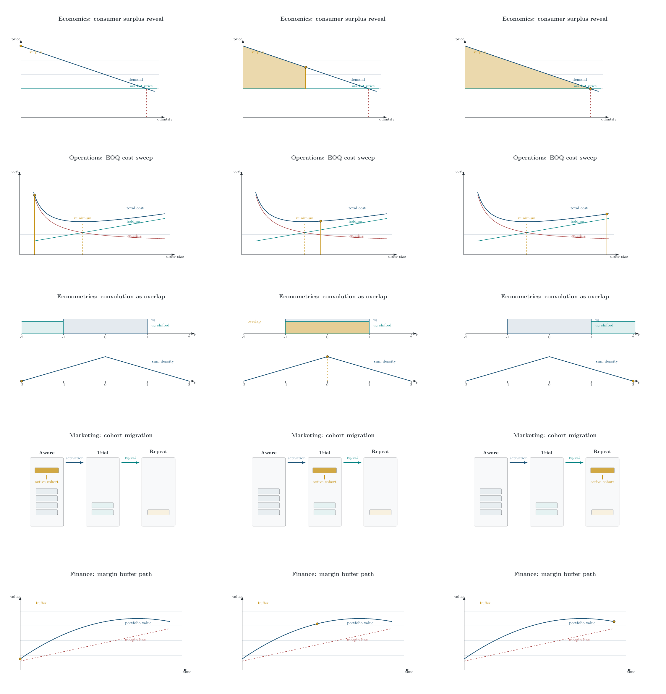 | Five department variants were generated from animation patterns and reviewed together as a contact sheet. |

Source patterns: TeXample animated definite integral, lower/upper Riemann sums, convolution, Towers of Hanoi, projectile, and Andler optimal lot-size.

**What to notice:** each department gets a reason to animate:

- Economics: area accumulation for consumer surplus.
- Econometrics: moving overlap for convolution of shocks.
- Finance: trajectory against a maintenance margin line.
- Marketing: cohort migration across states.
- Operations: EOQ tradeoff sweep across order quantity.

Skill decision: animation pattern transfer | family: multiple | review: department fit and contact-sheet inspection | outputs: five GIF previews and a contact sheet.

Checks to expect: pattern adaptation, department fit, `animate.sty` PDFs, GIF previews, contact-sheet review.

<details>
<summary>See the five department GIF previews</summary>

Economics<br>
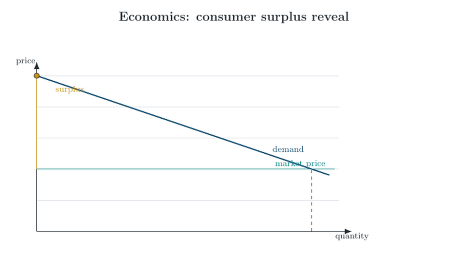

Econometrics<br>
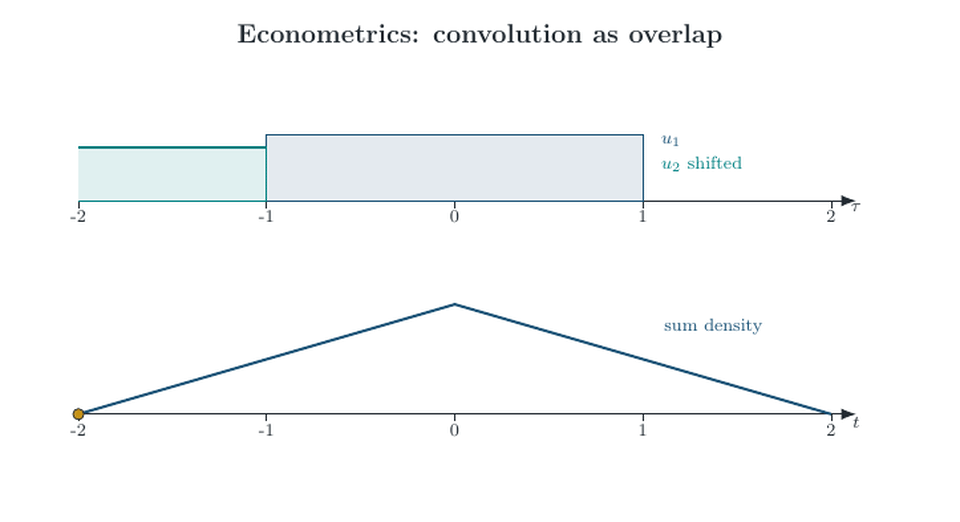

Finance<br>
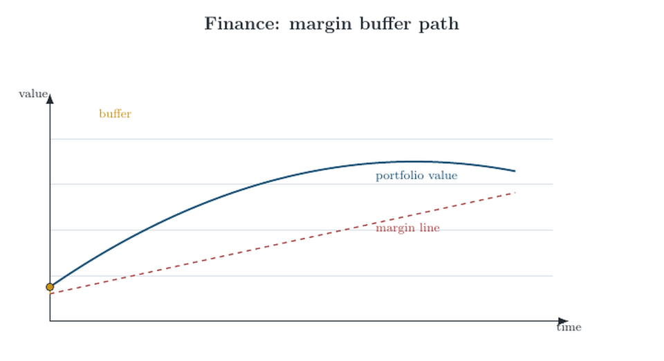

Marketing<br>
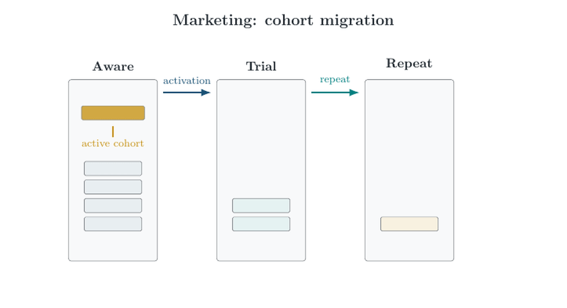

Operations<br>
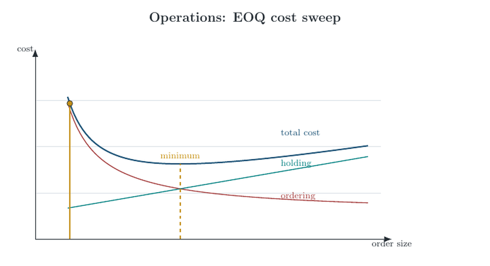

</details>

## Prompt Cookbook

<details>
<summary>Copy-paste detailed prompts</summary>

### Teaching Figure

```text
Use the tikz-diagrams skill to create a standalone teaching-mode TikZ diagram for [TOPIC].
Audience: [COURSE / SLIDE CONTEXT].
The diagram should teach one main idea: [MAIN IDEA].
Compile to PDF, render to PNG, run static safety and rendered visual QA, inspect the PNG manually, and write a short QA note.
Keep caption-style prose outside the rendered image.
```

### Research Figure

```text
Use the tikz-diagrams skill to create a standalone research-mode TikZ figure for [TOPIC].
Use direct labels and compact annotations suitable for a seminar or working paper.
Before drawing, run the math/diagram logic planning gate: identify variables, equations or constraints, expected ordering, and whether the figure is exact or schematic.
Compile, render, run visual QA, and record math_logic_review in the QA note.
```

### Animation

```text
Use the tikz-diagrams skill to create an animate.sty animation for [MECHANISM].
First decide whether animation is needed, what changes over time, whether motion should be discrete or smooth, and what pacing each frame needs.
Ask before using slow smooth transitions if they materially increase render time.
Produce the interactive PDF, a GIF preview, a key-frame contact sheet, and a QA note.
```

### Screenshot Or Paper Figure

```text
Use the tikz-diagrams skill to recreate and improve this source figure: [PATH OR URL].
Summarize the source context before drawing.
Preserve the substantive meaning, but improve readability where appropriate.
If geometry, thresholds, curves, payoffs, or estimates matter, run the math/diagram logic gate and say whether the output is exact or schematic.
Compile, render, run visual QA, and include the source context in the QA note.
```

### Hand-Drawn Or Whiteboard Style

```text
Use the tikz-diagrams skill to turn this hand-drawn sketch into a readable hand-drawn-style TikZ figure or animation: [IMAGE PATH].
Preserve the useful classroom feel, but make axes, labels, key points, and arrows readable.
Do not put long explanatory captions inside the image.
Run visual QA and inspect the output for clipping, overlap, and whether the hand-drawn style still communicates the concept.
```

### Precise Iteration

```text
Use the tikz-diagrams skill to revise [FIGURE.tex].
Patch only these changes:
1. [EXACT CHANGE]
2. [EXACT CHANGE]
3. [EXACT CHANGE]
Save as v02, rerun static safety, compile/render, rerun visual QA, and update the QA note with what changed.
Do not redesign unrelated parts of the figure.
```

</details>

## Core Workflow

The skill asks the agent to move through a figure workflow rather than jumping straight to code:

1. Identify the target medium: paper, Beamer slide, handout, template library, or exploratory sketch.
2. Choose presentation mode: `teaching`, `research`, or `compact`.
3. Identify the communication job: mechanism, workflow, assumptions, comparison, diagnostic, risk, tradeoff, or evidence summary.
4. Select a diagram family or domain template.
5. For model-dependent figures, run the math/diagram logic planning gate before drawing.
6. For animations, decide what changes over time, whether motion should be discrete or continuous, and whether smoothness is worth the render cost.
7. Write short labels first and keep caption-style prose outside the rendered image by default.
8. Run static checks.
9. Compile, render, and run rendered visual QA.
10. Inspect the PNG, GIF, or contact sheet.
11. Record the design outcome: `keep`, `simplify`, `split`, or `reject`.

## Quality Gates

### Static Safety

The static safety checker catches common TikZ hazards before compilation:

```bash
python3 "$SKILL_DIR/scripts/check_tikz_safety.py" path/to/diagram.tex
```

It is intentionally conservative. For macro-based figures, point it at the file containing the actual `tikzpicture` definitions as well as the wrapper source.

### Rendered Visual QA

Rendered visual QA checks the PDF/PNG result for visual failures that the TeX compiler cannot see:

```bash
python3 "$SKILL_DIR/scripts/compile_render.py" path/to/diagram.tex --visual-check --visual-mode teaching
```

It looks for title-band collisions, text overlap, clipped labels, near-edge labels, and crowded annotations. It does not replace manual inspection.

### Math And Diagram Logic

Visual plausibility is not enough for math, economics, statistics, or geometry diagrams. The skill includes a math/diagram logic gate for curves, equilibria, thresholds, payoffs, estimands, and comparative statics.

Record one of:

```text
math_logic_review: exact | schematic | needs_source | failed
```

Use `exact` only when plotted geometry is generated from stated equations, coordinates, data, or source values. Use `schematic` for qualitative teaching sketches.

### Animation QA

For animations, the PDF alone is not enough. A successful `animate.sty` PDF can still fail as a teaching artifact if the frames are too fast, labels appear before they are true, or the final state is crowded.

Expected animation artifacts:

- interactive `.tex` using `animate.sty`
- compiled interactive `.pdf`
- first-frame `.png`
- frame-preview `.tex` or frame deck
- GIF or MP4 preview
- contact sheet of key frames
- QA note with source pattern, pacing, checks, and repairs

## Install For AI Tools

Repository URL:

```text
https://github.com/Patrick-Healy/tikz-diagrams-skill
```

### Codex

Codex supports skills as folders with `SKILL.md`. Install from the GitHub directory URL with `$skill-installer`:

```text
$skill-installer install https://github.com/Patrick-Healy/tikz-diagrams-skill/tree/main/skills/tikz-diagrams
```

Manual install:

```bash
mkdir -p ~/.codex/skills
git clone https://github.com/Patrick-Healy/tikz-diagrams-skill.git /tmp/tikz-diagrams-skill
rsync -a /tmp/tikz-diagrams-skill/skills/tikz-diagrams/ ~/.codex/skills/tikz-diagrams/
```

Restart Codex after installing.

### Claude Code

Claude Code skills live in `~/.claude/skills/<skill-name>/SKILL.md` for personal installs or `.claude/skills/<skill-name>/SKILL.md` for project installs.

```bash
mkdir -p ~/.claude/skills
git clone https://github.com/Patrick-Healy/tikz-diagrams-skill.git /tmp/tikz-diagrams-skill
rsync -a /tmp/tikz-diagrams-skill/skills/tikz-diagrams/ ~/.claude/skills/tikz-diagrams/
```

Development symlink:

```bash
ln -s "$PWD/skills/tikz-diagrams" ~/.claude/skills/tikz-diagrams
```

### Gemini CLI

Gemini CLI supports extensions with `gemini-extension.json` and a context file. This repository includes both.

```bash
gemini extensions install https://github.com/Patrick-Healy/tikz-diagrams-skill
```

Local development:

```bash
git clone https://github.com/Patrick-Healy/tikz-diagrams-skill
cd tikz-diagrams-skill
gemini extensions link .
```

### Cursor

Cursor supports project rules in `.cursor/rules` and root-level `AGENTS.md` instructions.

```bash
git clone https://github.com/Patrick-Healy/tikz-diagrams-skill.git /tmp/tikz-diagrams-skill
cp /tmp/tikz-diagrams-skill/AGENTS.md /path/to/project/AGENTS.md
mkdir -p /path/to/project/.cursor/rules
cp /tmp/tikz-diagrams-skill/.cursor/rules/tikz-diagrams.mdc /path/to/project/.cursor/rules/
```

Then ask Cursor to read `skills/tikz-diagrams/SKILL.md` from this repository or copy the skill folder into the target project.

### VS Code And GitHub Copilot

VS Code and GitHub Copilot support repository custom instructions in `.github/copilot-instructions.md` and path-scoped `.github/instructions/*.instructions.md` files.

```bash
git clone https://github.com/Patrick-Healy/tikz-diagrams-skill.git /tmp/tikz-diagrams-skill
mkdir -p /path/to/project/.github/instructions
cp /tmp/tikz-diagrams-skill/.github/copilot-instructions.md /path/to/project/.github/copilot-instructions.md
cp /tmp/tikz-diagrams-skill/.github/instructions/tikz-diagrams.instructions.md /path/to/project/.github/instructions/
```

### Visual Studio With Copilot

Use the same GitHub Copilot repository instructions:

```bash
mkdir -p /path/to/project/.github/instructions
cp .github/copilot-instructions.md /path/to/project/.github/copilot-instructions.md
cp .github/instructions/tikz-diagrams.instructions.md /path/to/project/.github/instructions/
```

### Antigravity

Antigravity guidance is less standardized publicly than Codex, Claude Code, Gemini CLI, Cursor, and Copilot. The most portable approach is to use `AGENTS.md` and/or `GEMINI.md` at the project root, then tell the agent to read the skill folder.

```bash
git clone https://github.com/Patrick-Healy/tikz-diagrams-skill.git /tmp/tikz-diagrams-skill
cp /tmp/tikz-diagrams-skill/AGENTS.md /path/to/project/AGENTS.md
cp /tmp/tikz-diagrams-skill/GEMINI.md /path/to/project/GEMINI.md
```

## Dependencies

The skill can be read by any agent as plain Markdown. Rendering workflows need local tools:

- Python 3.10+
- Python packages: `Pillow`, `PyMuPDF`
- TeX distribution: TeX Live or MiKTeX with `xelatex`
- Poppler command-line tools with `pdftoppm`
- `ffmpeg` for GIF/MP4 animation previews
- ImageMagick with the `magick` command for animation contact sheets

Agents should ask before installing missing dependencies. The permission request should name the package manager or source, list packages, and explain what check or render step needs them.

Common macOS setup:

```bash
brew install --cask mactex
brew install poppler ffmpeg imagemagick
python3 -m pip install Pillow PyMuPDF
```

Common Ubuntu setup:

```bash
sudo apt-get update
sudo apt-get install -y texlive-xetex texlive-latex-extra poppler-utils ffmpeg imagemagick python3-pip
python3 -m pip install Pillow PyMuPDF
```

Common Windows setup:

```powershell
winget install MiKTeX.MiKTeX
winget install Python.Python.3.12
winget install Gyan.FFmpeg
winget install ImageMagick.ImageMagick
python -m pip install Pillow PyMuPDF
```

Poppler on Windows is easiest through MSYS2, Chocolatey, or a trusted Poppler build. Verify `pdftoppm` is on `PATH`.

## Additional Verification Commands

After cloning, the fastest local check is:

```bash
export SKILL_DIR="$PWD/skills/tikz-diagrams"
python3 "$SKILL_DIR/scripts/check_tikz_safety.py" "$SKILL_DIR/templates/standalone.tex"
```

For a real diagram:

```bash
python3 "$SKILL_DIR/scripts/compile_render.py" path/to/diagram.tex --visual-check --visual-mode teaching
```

For an animation frame deck:

```bash
python3 "$SKILL_DIR/scripts/render_animation_preview.py" path/to/frames.pdf --fps 8 --key-frames 1,10,20
```

## Source Provenance

The showcase uses a mixture of written prompts, local test outputs, paper-figure screenshots, and rough sketch screenshots to demonstrate the workflow.

- The NBER examples are source-context demonstrations. Cite and link the underlying paper when using them in public teaching or research material.
- The rough J-curve and AD-AS sketch inputs are classroom-sketch style examples. Replace third-party thumbnails or screenshots with licensed, original, or course-owned images before public promotion.
- The game-tree row uses the public `pics/signaling.png` input from `gjoncas/Econ-Diagrams`.
- The generated TikZ outputs, GIF previews, contact sheets, and QA notes are produced by the skill workflow and are included to show what the agent should create and inspect.

## Sources Checked For Install Guidance

- Claude Code skills: https://code.claude.com/docs/en/skills
- OpenAI skills catalog: https://github.com/openai/skills
- Gemini CLI extensions: https://google-gemini.github.io/gemini-cli/docs/extensions/
- VS Code custom instructions: https://code.visualstudio.com/docs/copilot/customization/custom-instructions
- GitHub Copilot repository instructions: https://docs.github.com/en/copilot/how-tos/copilot-on-github/customize-copilot/add-custom-instructions/add-repository-instructions
- Cursor rules: https://docs.cursor.com/context/rules-for-ai
